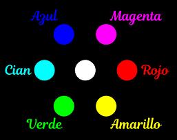
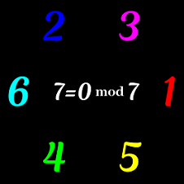
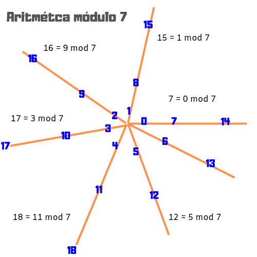

# El hexágono de la Creación

### Alegorías de colores y bíblicos días

> "Con estas razones perdía el pobre caballero el juicio, y desvelábase por entenderlas y desentrañarles el sentido, que no se lo sacara ni las entendiera el mesmo Aristóteles, si resucitara para solo ello"

---

La Biblia, el texto más leído de la historia. El Antiguo Testamento es escritura sagrada de dos religiones. Una de ellas tiene más adeptos que ninguna otra en el mundo. Muchos son aún los que creen que los relatos biblícos son verdad absoluta y que, por ejemplo, las plantas no debieron pasar por un proceso de evolución de millones de años, sino que Dios las hizo crecer en un día con su milagroso poder. 

¿Por qué creó Dios el mundo en seis días? Los eventos del primer relato del Génesis transcurren en un periodo de tiempo demasiado corto para los estándares de la ciencia moderna y demasiado largo para un ser todo poderoso que bien pudo haber dicho 'sea todo ya'. Un 'literalista' dirá que Dios quiso establecer un patrón de días de trabajo y descanso que fuera bueno para el hombre. Pero ¿por qué no 5 u 8 días?, ¿ya sabía Dios desde el principio que Adán se comería la manzana y que debería condenarle, por tanto, a trabajar el resto de sus días?

El literalismo absoluto no es la postura oficial de la iglesia católica. Muchos son ya los cristianos que están dispuestos a interpretar el Génesis de manera simbólica. Un 'literalista' dirá que la interpretación simbólica implica conceder que la ciencia tiene más autoridad que la palabra de Dios. Otro cristiano, más convincentemente, responderá que no debería haber ninguna discrepancia entre la obra de Dios y la palabra de Dios. ¿Quién se cree enviado de Dios para afirmar que su interpretación es la correcta? 

No sé si correcta, pero la llamada "framework interpretation" es bonita. [En este enlace puede conocer el lector algunos de sus proponentes, argumentos en pro y en contra y bibliografía](https://en.wikipedia.org/wiki/Framework_interpretation_(Genesis)). La idea básica es que los tres primeros días de la Creación, Dios creó los escenarios que luego poblaría en los siguientes tres días con seres animados, de manera que se pueden hacer pares:

Día 1 - Día 4  
El primer día Dios crea el día y la noche y en el cuarto los puebla con el sol y la luna y las estrellas (que podrían considerarse seres animados porque se mueven).

Día 2 - Día 5  
En el segundo día Dios crea el mar y el 'cielo', y en el quinto los puebla con peces y aves.

Día 3 - Día 6  
En el tercer día Dios crea la Tierra (con todo y plantas, que no se mueven mucho), y en el sexto la puebla con bestias y con el hombre.

"Y así fueron acabados los cielos y la tierra (o sea, todo cuanto existe) y sus vastas huestes". De acuerdo al mismo relato, nada faltaba ya. ¿Por qué romper la rima 'lunes y martes y miércoles, tres'-'jueves y viernes y sábado, seis' con un 'domingo, siete'? ¿Un Dios todopoderoso necesitaba descansar? ¿Por qué sólo un día para glorificar la obra de Dios? ¿Por qué no otros 6, por ejemplo?

Tal vez era necesario justificar míticamente una semana de 7 días que quizá tuvo su origen en la duración usual de una fase lunar (si se divide el ciclo lunar de 29.53 días entre 4, se obtienen 7.38 días). Tal vez el 7 era ya un número importante para los judíos por cualquier otro motivo, y por eso la Biblia esta llena de sietes, comenzando por el primer verso, "en el principio creó Dios los Cielos y la Tierra", que en la versión hebrea tiene 7 palabras y 28 = 7x4 letras. 

En cualquier caso, si se colocan 6 puntos en círculo, formando un hexágono, se pueden preservar todas las simetrías si se añade un séptimo punto en el centro. Esta figura puede hallarse en otro ámbito que, de hecho, es más universal que las religiones nacidas del desierto de Canaan: los colores primarios de luz, rojo, azul y verde. Dispónganse en un triángulo y, entre los vértices, obténganse sus combinaciones:

Y al combinar todos, en el centro, está el blanco. 

---

Día 1 - Rojo  
Al asociar el rojo con el fuego y el fuego con la luz que crea Dios el primer día.

Día 2 - Azul  
El color del cielo profundo y los mares profundos que separa Dios el segundo día.

Día 3 - Verde  
El color de las plantas que cubren la Tierra que crea Dios el tercer día.

Día 4 - Rojo + Azul
Al asociar el fuego con las luminarias que se colocan en el cielo profundo.

Día 5 - Azul + Verde
Cian, el color del agua somera y el cielo claro, donde habitan los peces y las aves.

Día 6 - Verde + Rojo
En la tierra verde habita el hombre con su fuego.

Y ¿qué color se puede asociar mejor al séptimo día, en que se glorifica a Dios, que el blanco luminoso y pleno? 

---

Este esquema de colores primarios tampoco es tan universal, porque depende de la percepción humana (y no daltónica) de una reducida franja del espectro lumínico. Al menos aditivamente, los colores primarios se comportan de manera muy similar a los números de un [campo algebraico de 7 elementos](https://www.nku.edu/~christensen/Introduction%20to%20finite%20fields%20I.pdf):

No es necesario que el lector esté versado en matemáticas para apreciar la belleza de la figura anterior, pero si le da curiosidad saber qué significa la expresión "7 = 0 mod 7", o entender un poco mejor la explicación de los campos finitos del enlace anterior, [puede intersarle esta introducción a la aritmética modular](https://www.khanacademy.org/computing/computer-science/cryptography/modarithmetic/a/what-is-modular-arithmetic) (la notación es un poco diferente, en lugar de escribir "7 = 0 mod 7", escribirían "7 mod 7 = 0", pero es lo mismo). 

---

Obsérvese nuevamente el siguiente esquema:

Quizá haya notado el lector una aparente incongruencia. En este esquema el verde corresponde al número 4, pero habíamos asociado al verde con el Día 3 de la Creación. De hecho, los únicos colores que cuyo número y día coinciden son el rojo y el azul, todos los demás se 'descompusieron'. Bueno pues... los designios de Dios son insondables ¿no?... Aunque también puede hallarse un solución a este problema. 

Para entenderlo, notemos primero que en el esquema aparece un octavo número: el 0. El cero, la nada. El ámbito desordenado y vacío que existía antes de que Dios dijera "sea".  El color negro, vacío, en que está inmerso el hexágono de colores primarios de luz. 

¿Por qué existe el Ser en lugar de la Nada? El *Ser* de la Creación surge del *No Ser* primordial. Luego, el *Ser* - Vida desemboca inevitablemente en el *No Ser* - Muerte, pero es necesario que haya muerte para que pueda surgir nueva vida. 

*No Ser* - *Ser*, negro - blanco, noche - día, frío - calor. Igual de malo es el calor en exceso que la ausencia completa de calor. Podríamos representar esta dualidad fundamental con el símbolo del Yin-Yang, aunque la alegoría se acercaría más al relato de la Creación si simplemente pintamos un punto de luz blanca en medio de la oscuridad. Algo así como una estrella blanca en medio del universo vacío. La oscuridad *No Ser*. Un único punto de luz *Ser*, un único Dios. Pero esta unicidad simple y luminosa, ¿puede realmente ser concebida sin el fondo negro?

En el sistema binario bastan el *No Ser* - Cero y el *Ser* - Uno para expresar todos los infinitos números naturales. 

Combinaciones binarias de 1 dígito:  
0 - Cero  
1 - Uno

Combinaciones binarias de 2 dígitos:
00 - Cero  
01 - Uno  
10 - Dos  
11 - Tres

Combinaciones binarias de 3 dígitos:
000 - Cero
001 - Uno
010 - Dos
011 - Tres
100 - Cuatro
101 - Cinco
110 - Seis
111 - Siete

Observemos que estas últimas combinaciones se pueden agrupar en cuatro subconjuntos:  

Números en los que el *Ser* no se manifiesta ni una vez: 000.  
Números en los que el *Ser* se manifiesta una vez: 001, 010, 100.
Números en los que el *Ser* se manifiesta dos veces: 011, 101, 110.
Números en los que el *Ser* se manifiesta triple: 111.

De acuerdo a este esquema, en el relato de la Creación, los primeros tres días se corresponden con los combinaciones binarias que sólo contienen un 1, y los siguientes tres días se corresponden con aquellas en que el 1 aparece dos veces. El séptimo día corresponde al 111, y el 000 corresponde al día cero, antes de los días. 

