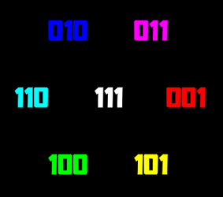
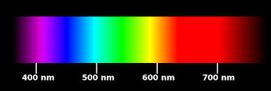

# Siete días y un hexágono.

> "Con estas razones perdía el pobre caballero el juicio, y desvelábase por entenderlas y desentrañarles el sentido, que no se lo sacara ni las entendiera el mesmo Aristóteles, si resucitara para solo ello"

---

La Biblia. El texto más leído de la historia. El Antiguo Testamento es escritura sagrada de dos religiones. Una de ellas tiene más adeptos que ninguna otra en el mundo. Aún son muchos los que creen que los relatos biblícos son verdad absoluta, y hay quienes creen, por ejemplo, que las plantas no debieron pasar por un proceso de evolución de millones de años, sino que Dios las hizo crecer en un día con su milagroso poder. 

¿Por qué creó Dios el mundo en seis días? Los eventos del primer relato del Génesis transcurren en un periodo de tiempo demasiado corto para los estándares de la ciencia moderna y demasiado largo para un ser todo poderoso que bien pudo haber dicho 'sea todo ya'. Un 'literalista' dirá que Dios quiso establecer un patrón de días de trabajo y descanso adecuado para el hombre. Pero ¿por qué no 5 u 8 días?, ¿ya sabía Dios desde el principio que Adán se comería la manzana y que debería condenarle, por tanto, a trabajar el resto de sus días?

El literalismo absoluto no es la postura oficial de la iglesia católica. Muchos son ya los cristianos que están dispuestos a interpretar el Génesis de manera simbólica. Un 'literalista' dirá que la interpretación simbólica implica conceder que la ciencia tiene más autoridad que la palabra de Dios. Otro cristiano, más convincentemente, responderá que no debería haber ninguna discrepancia entre la obra de Dios y la palabra de Dios. ¿Quién se cree enviado de Dios para afirmar que su interpretación es la correcta? 

---

No sé si es la correcta, pero la llamada "framework interpretation" es, cuando menos, interesante. [En este enlace puede conocer el lector algunos de sus proponentes, argumentos en pro y en contra y bibliografía](https://en.wikipedia.org/wiki/Framework_interpretation_(Genesis)). La idea básica es que los tres primeros días de la Creación, Dios creó los escenarios que luego poblaría en los siguientes tres días con seres animados, de manera que se pueden hacer pares:

Día 1 - Día 4  
El primer día Dios crea el día (valga la redundancia) y la noche, y en el cuarto los puebla con el sol y la luna y las estrellas (que podrían considerarse seres animados porque se mueven).

Día 2 - Día 5  
En el segundo día Dios crea el mar y el cielo, y en el quinto los puebla con peces y aves.

Día 3 - Día 6  
En el tercer día Dios crea la Tierra (con todo y plantas, que no se mueven mucho), y en el sexto la puebla con bestias y con el hombre.

Con estas dos simétricas tercias "fueron acabados los cielos y la tierra". Y, sin embargo, se agrega un séptimo día. Y el septimo día es bendecido y santificado por Dios. 

---

Si se colocan 6 puntos en círculo, formando un hexágono, el resultado es bastante simétrico. Si se coloca un séptimo punto en el centro, las simetrías no se ven alteradas. Consideremos los colores primarios de luz: rojo, azul y verde. Dispónganse en un triángulo y, entre los vértices, obténganse sus combinaciones:

La estructura de este hexágono evoca bastante la estructura del primer relato del Génesis. ¿Podrán asociarse los colores y los días? Propuesta:

Día 1 - Rojo  
Si se asocia el rojo con el fuego, y el fuego con la luz; la luz que crea Dios el primer día. 

Día 2 - Azul  
El color del cielo profundo y los mares profundos, es decir, las aguas que separa Dios el segundo día.

Día 3 - Verde  
El color de las plantas que cubren la Tierra que crea Dios el tercer día. 

Día 4 - ¿Magenta?

Día 5 - Cian  
El color de las aguas someras y el cielo claro que habitan los peces y las aves.

Día 6 - ¿Amarillo?

Día 7 - Blanco  
¿Qué color se puede asociar mejor al séptimo día, que el blanco luminoso y pleno? 

---

El esquema de los colores depende de la percepción humana (y no daltónica) de una reducida franja del espectro lumínico. Más universales son las matemáticas. Obsérvese el siguiente esquema:

Así como los colores primarios se combinan para producir magenta, cian y amarillo, los números 1, 2 y 4 se suman, produciendo de manera análoga los números 3, 6 y 5. Al combinar los tres colores primarios se obtiene el blanco y, análogamente, 1 + 2 + 4 = 7. 

Este esquema de números se torna aún más interesante si se considera la aritmética módulo 7. [En este enlace se explica con detalle y esmero la aritmética modular](https://www.khanacademy.org/computing/computer-science/cryptography/modarithmetic/a/what-is-modular-arithmetic). En el caso específico del 7, dos números son iguales módulo 7, si la diferencia entre ellos es múltiplo de 7. Por ejemplo, 27 = 6 módulo 7 porque 27 - 6 = 3x7. Es como identificar cada número con algún número menor que 7: 

Puede comprobar entonces el lector que la suma de los números del triángulo de colores secundarios también es 7 módulo 7, y los números que están en medio de cada par de colores secundarios, también es la suma, módulo 7, de los colores correspondientes. 

De hecho, este hexágono de números constituye un [campo algebraico de 7 elementos](https://www.nku.edu/~christensen/Introduction%20to%20finite%20fields%20I.pdf), lo cuál básicamente significa que la multiplicación también se comporta 'bonito'.

---

Consideremos el cero. La nada. El ámbito desordenado y vacío que existía antes de que Dios dijera "sea". El color negro, vacío, en que está inmerso el hexágono de colores primarios de luz. 

¿Por qué existe el Ser en lugar de la Nada? El *Ser* de la Creación surge del *No Ser* primordial. Luego, el *Ser* - Vida desemboca inevitablemente en el *No Ser* - Muerte, pero es necesario que haya muerte para que pueda surgir nueva vida. *No Ser* - *Ser*, negro - blanco, noche - día, frío - calor. Igual de malo es el calor en exceso que la ausencia completa de calor. 

Podríamos representar esta dualidad fundamental con el símbolo del Yin-Yang, pero también podríamos pensar simplemente en un punto de luz blanca en medio de la oscuridad. Una estrella en medio del universo. Un único punto de luz *Ser*, un único Dios. Pero esta unicidad simple y luminosa, ¿puede realmente ser concebida sin el fondo negro?

En el sistema binario bastan el *No Ser* - Cero y el *Ser* - Uno para expresar todos los números naturales. 

Combinaciones binarias de 1 dígito:  
0 - Cero  
1 - Uno

Combinaciones binarias de 2 dígitos:  
00 - Cero  
01 - Uno  
10 - Dos  
11 - Tres

Combinaciones binarias de 3 dígitos:  
000 - Cero  
001 - Uno  
010 - Dos  
011 - Tres  
100 - Cuatro  
101 - Cinco  
110 - Seis  
111 - Siete

Observemos ahora la siguiente versión binaria del campo algebraico de 7 elementos:

En realidad, en el campo de 7 elementos, el número que se encuentra en el centro es el neutro aditivo, es decir, el cero. Pero así como la aritmética módulo 7 no distingue el 7 del 0, ¿cómo distingue un detector de carga eléctrica si la carga neutra se debe a la ausencia de elementos o a la presencia de un elemento negativo combinado con un elemento positivo? Lo mismo puede preguntarse de un detector de carga de color, esa que poseen los quarks, ¿cómo distinguir el vacío, la ausencia de elementos, de la presencia de un quark 'rojo', uno 'azul' y uno 'verde' combinados? Ambas cargas son neutras.

Nunca está de más insistir en que los 'colores' de las cargas de los quarks no tienen nada que ver con los colores que ven nuestros ojos. Los descubridores de la 'carga de color', simplemente necesitaban una nomenclatura para el fenómeno que acababan de descubrir, el cual funciona con tres tipos de cargas que se combinan. Se les ocurrieron los colores primarios porque también son tres y también se combinan, pero no hay ninguna otra conexión. 

Mi punto es, si el Todo incluye realmente todas las fuerzas y si al incluir todas las fuerzas, éstas se equilibran, ¿cómo distinguir esta plenitud del equilibrio perfecto de fuerzas que existe en la Nada?

---

Si consideramos al 0 como símbolo de la ausencia de luz y al 1 como símbolo de un elemento de luz, entonces es claro que en las combinaciones binarias de 3 dígitos, el 000 corresponde al negro y el 111 al blanco. Las restantes 6 combinaciones pueden dividirse en dos categorías:

Números con un elemento de luz: 001, 010, 100.  
Números con dos elementos de luz: 011, 101, 110.  

Los colores primarios, rojo, azul y verde, son visiblemente menos luminosos que sus combinaciones.

De acuerdo a este esquema, en el relato de la Creación, los primeros tres días se corresponden con los combinaciones binarias que sólo contienen un 1, y los siguientes tres días se corresponden con aquellas en que el 1 aparece dos veces. El séptimo día corresponde al 111, y el 000 corresponde al día cero, antes de los días. 

001 - Día 1  
El 001 es el uno. Dios es uno, y una es la voluntad de Dios que dijo 'sea la luz', y aparece un punto de luz en medio de la oscuridad.

010 - Día 2
El 010 es el dos. El segundo día se separaron las aguas. Existen ahora dos aguas, las de arriba y las de abajo.

100 - Día 3.
El 100 es el cuatro. La Tierra, que surge el tercer día, posee cuatro puntos cardinales. La seca tierra es sólida como un cuadrado, estable como una mesa con cuatro puntos de apoyo. 

Los primeros tres días recorren el triángulo de los colores que poseen sólo un elemento de luz, rotando un tercio del círculo para ir de un punto al otro. En los diagramas he presentado el punto que corresponde al 1, a la derecha del eje horizontal que atraviesa el círculo, y la rotación de los días va hacia la izquierda. Los siguientes 3 días recorren los colores con dos elementos de luz, rotando también hacia la izquierda, casi repitiendo el mismo recorrido de los primeros tres días. 

En este campo algebraico de 7 elementos, multiplicar dos números equivale a rotar hacia la izquierda uno de ellos, por el ángulo que forma el otro punto con el 1, que es el neutro multiplicativo. El lector puede comprobar, por ejemplo, que 2x4 = 8 = 1 mod 7, y que si se para en el punto 2 y rota a la izquierda tanto como el ángulo que forma el 4 con el 1, llega al punto 1. Similarmente, multiplicar 6 por 6 equivaldría a dar dos medias vueltas, que te regresa al punto de partida, y 6x6 = 36 = 1 mod 7, que es el neutro multiplicativo. 

---

En el esquema que surge de la dualidad fundamental *Ser* - *No Ser*, cada potencia de 2 provee una alegoría del universo entero. Si empezamos con 2^0, obtenemos una sola entidad, que podemos concebir como el Todo, el universo en su conjunto. De esa única entidad primigenia surge la dualidad 2^1. De 2^3 hemos obtenido el *No Ser* 000 más las 7 entidades que hemos relacionado con las etapas de la Creación (la cual, que ciertamente simboliza al universo entero). Nos hemos saltado 2^2, que provee el *No Ser* 00 más otras 3 entidades. 

Al igual que 7, el número 3 es primo, de modo que también existe un campo algebraico de 3 elementos. Esta magia se pierde con 2^4, pero se recupera con 2^5. Los números primos de la forma 2^n - 1 se conocen como primos de Mersenne. Entre otras cuestiones de interés matemático, todos los números perfectos que se conocen son pares, triangulares, hexagonales y están determinados por primos de Mersenne.

2^1 - 1 = 1 &nbsp; &nbsp; Dios es uno.  
2^2 - 1 = 3 &nbsp; &nbsp; ¿No son tres son las personas de la Trinidad cristiana: Padre, Hijo y Espíritu Santo?  
2^3 - 1 = 7 &nbsp; &nbsp; Siete son los días de la Creación, y es el número que más veces se repite en la Biblia.

En realidad, lo de la Trinidad cristiana no tiene nada que ver con lo que aquí se discute. Concentrémonos más bien en los tres sustantivos que aparecen en el primer versículo del Génesis: Dios, Cielo, Tierra. Y en el hecho de que tres puntas tienen cada uno de los triángulos del hexágono que hemos estudiado. El autor monoteista del Génesis nos habla de 7 días que pueden estructurarse en 3 pares más 1 día. 7, 3, 1.

¿Poseía entonces el autor del Génesis una sabiduría arcana que incluía los campos algebraicos y los primos de Mersenne? Desde luego que no. Quizá su motivación era fundamentar míticamente una semana de 7 días, tal vez originada en el hecho de que las fases lunares duran aproximadamente 7.4 días. O quizá el número 7 era importante para los judíos por cualquier otro motivo. La cuestión es que al querer darle cierta estructura simétrica a los 7 días, el número 3 aparece de manera natural. En cuanto a que se usaran tres sustantivos en el primer versículo, bien pudo haber sido mera casualidad. 

---

Si asociamos nuevamente el fuego con la luz que protagoniza el par Día 1 - Día 4, tenemos lista para la hoguera de la inquisición la siguiente herejía:

Par de días | Sustantivo | Elemento | Persona
-|-|-|-
Día 1 - Día 4 | Dios | Fuego  | Padre
Día 2 - Día 5 | Cielos | Agua | Espíritu Santo
Día 3 - Día 6 | Tierra | Tierra | Hijo

Que ni se preocupe el Santo Oficio, que también es material para la hoguera del racionalismo. Estas asociaciones no tienen ningún sustento, ni racional, ni religioso, ni histórico. Ni siquiera he encontrado sitio esotórico alguno que presente algo similar. Tal vez podría defenderlas desde un punto de vista filosófico, pero me da flojera siquiera leer a Espinoza, al menos por ahora. Así que el lector es libre de hacer con esto lo que le plazca. Pero si lo que le place es meditar sobre estas cuestiones, digamos otro par de cosas.

1. Que si ordenamos los elementos alquímicos del más sutil al más denso, entonces los días de la creación los recorren en orden. De los cuatro elementos clásicos, falta uno, el aire, que es el más sutil y podríamos asociar con el *No Ser*. Y si en las combinaciones binarias de dos dígitos (que surgen de 2^2), asociamos el 0 con la sutileza y el 1 con la densidad, entonces aire - fuego - agua - tierra se corresponden bien con 00 - 01 - 10 - 11.

2. Observemos el verdedadero espectro de los colores:

